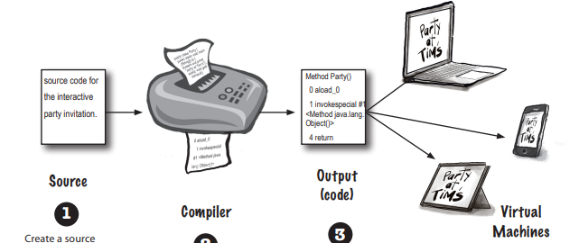
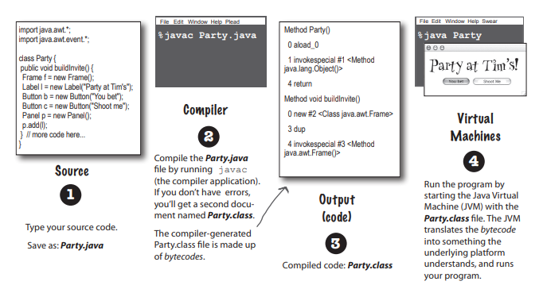
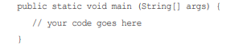
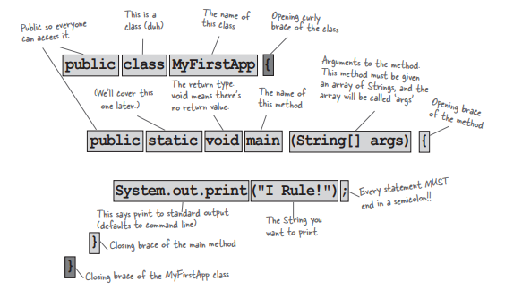

# THE WAY JAVA WORKS
The goal is to write one application and have it work on whatever device your friends have.

1. Source: Create a source document. Use an established protocol (in this case, the Java language).
2. Compiler: Run your document through a source code compiler. The complier checks for errors and won't let you compile until it's satisfied the everything will run correctly.
3. Output: Ther cpompiler creates a new document, coded into Java bytecode. The compiled bytecode is platform-independent.
4. Virtual Machines: Java Virtual machine (JVM), implemented in software, running inside their electronic gadgets. When your friends run your program, the virtual machine reads and runs the bytecode.
# What you'll do in Java
You'll type a source code file, compile it using the javac compiler, and then run the compiled bytecode on a Java virtual machine.

For example: 

# Speed and memory usage
When Java was first released, it was slow. But soon after, the HotSpot VM was created, as were other performance enhancers. While its's true that Java isn't the fastest language out there, it's considered to be a very fast languge - almost as fast as languages like C and Rust, and much faster than most other languages out there.

Java has a magic super-power -- the JVM. The JVM can optimizr your code while it's running, so it's possible to create very fast applications without having to specialized high-performance code.
But full disclosure compared to C and Rust, Java uses a lot of memory 
# Code structure in Java
- In a source file, put a class.
- In a class, put methods.
- In a method, put statements.

. What goes in a source file?

A source code file (with the .jave extension) typically holds one class definition. The class represents a piece of ypur program, although a very tiny application might need just a single class. The class must go within a pair of curly braces.

. What goes in a class?

A class has one or more methods. For example: In the Dog class, the bark method will hold instructions for how the Dog should bark. Your methods must be declared inside a class (in other words, within the curly braces of the class).

. What goes in a method?

Within the curly braces of a method, write your instruction for how that method should be performed. Method code is basically a set statements, and for now you can think of a method kind od like a function or procedure.

# Anatomy of a class
When the JVM starts running, it looks for the class you give it at the command line, Then it starts looking for a specially written method that look exactly like:

Next, the JVM run everything between the curl braces {} of your main method. Every Java application has to have at least one class, and at least one main methoad ( not one main per class; just one main per application).

# Writting a class with a main()
In Java, everything goes in a class. You'll type your source code file (with a.java extension), then compile it intio a new class file (with a .class extension). When you run your program you're really running a class.

Running a program means telling the Java Virtual Machine (JVM) to "Load the MyFirstApp class, then start executing its main() method. Keep running 'til all the code in main is finished".

The main() method is where your program starts running.

No matter how big your program is (in other words, no matter how many classes your program uses), there's got to be a main() method to get the ball rolling.

# What can you say in the main method
Once you'r inside main (or any method), the fun begins. you can say all the normal things that you say in most programming languages to make the coputer do something.

Your code can tell the JVM to:
- Do something
    
    Statements: declarations, assignments, method calls, etc.

    int x = 3;

    String name = "Dirk";

    x = x*17;

    System.out.print ("x is" + x);

    double d = Math.random();

    // this is a comment

- Do something again and again

    Loops: for and while

    while (x>12) 

    {
        
        x = x-1;

    }

    for ( int i = 0; i < 10; i = i+1>)

    {

        Systen.out.print("i is now" + 1);
    }

- Do something under this condition

    Branching: if/else tests

    if ( x==10) 

    {

        System.out.print("x must be 10");

    } else {

        System.out.print ("x isn't 10");

    }

    if ((x<3)&&(name.equals("Dirk"))){

        System.out.println("Gently");

    }

    System.out.print("this line runs to matter what");