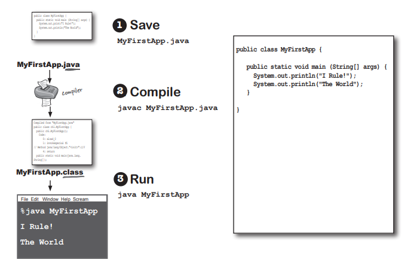

# THE WAY JAVA WORKS
The goal is to write one application and have it work on whatever device your friends have.

1. Source: Create a source document. Use an established protocol (in this case, the Java language).
2. Compiler: Run your document through a source code compiler. The complier checks for errors and won't let you compile until it's satisfied the everything will run correctly.
3. Output: Ther cpompiler creates a new document, coded into Java bytecode. The compiled bytecode is platform-independent.
4. Virtual Machines: Java Virtual machine (JVM), implemented in software, running inside their electronic gadgets. When your friends run your program, the virtual machine reads and runs the bytecode.
# What you'll do in Java
You'll type a source code file, compile it using the javac compiler, and then run the compiled bytecode on a Java virtual machine.

For example: 

# Speed and memory usage
When Java was first released, it was slow. But soon after, the HotSpot VM was created, as were other performance enhancers. While its's true that Java isn't the fastest language out there, it's considered to be a very fast languge - almost as fast as languages like C and Rust, and much faster than most other languages out there.

Java has a magic super-power -- the JVM. The JVM can optimizr your code while it's running, so it's possible to create very fast applications without having to specialized high-performance code.
But full disclosure compared to C and Rust, Java uses a lot of memory 
# Code structure in Java
- In a source file, put a class.
- In a class, put methods.
- In a method, put statements.

. What goes in a source file?

A source code file (with the .jave extension) typically holds one class definition. The class represents a piece of ypur program, although a very tiny application might need just a single class. The class must go within a pair of curly braces.

. What goes in a class?

A class has one or more methods. For example: In the Dog class, the bark method will hold instructions for how the Dog should bark. Your methods must be declared inside a class (in other words, within the curly braces of the class).

. What goes in a method?

Within the curly braces of a method, write your instruction for how that method should be performed. Method code is basically a set statements, and for now you can think of a method kind od like a function or procedure.

# Anatomy of a class
When the JVM starts running, it looks for the class you give it at the command line, Then it starts looking for a specially written method that look exactly like:

Next, the JVM run everything between the curl braces {} of your main method. Every Java application has to have at least one class, and at least one main methoad ( not one main per class; just one main per application).

# Writting a class with a main()
In Java, everything goes in a class. You'll type your source code file (with a.java extension), then compile it intio a new class file (with a .class extension). When you run your program you're really running a class.

Running a program means telling the Java Virtual Machine (JVM) to "Load the MyFirstApp class, then start executing its main() method. Keep running 'til all the code in main is finished".

The main() method is where your program starts running.

No matter how big your program is (in other words, no matter how many classes your program uses), there's got to be a main() method to get the ball rolling.

# What can you say in the main method
Once you'r inside main (or any method), the fun begins. you can say all the normal things that you say in most programming languages to make the coputer do something.

Your code can tell the JVM to:
- Do something
    
    Statements: declarations, assignments, method calls, etc.

    int x = 3;

    String name = "Dirk";

    x = x*17;

    System.out.print ("x is" + x);

    double d = Math.random();

    // this is a comment

- Do something again and again

    Loops: for and while

    while (x>12) 

    {
        
        x = x-1;

    }

    for ( int i = 0; i < 10; i = i+1>)

    {

        Systen.out.print("i is now" + 1);
    }

- Do something under this condition

    Branching: if/else tests

    if ( x==10) 

    {

        System.out.print("x must be 10");

    } else {

        System.out.print ("x isn't 10");

    }

    if ((x<3)&&(name.equals("Dirk"))){

        System.out.println("Gently");

    }

    System.out.print("this line runs to matter what");

# Looping and looping and...
Java has a lot of looping constructs: while, do-while, and for, being the oldest. You'll get the full loop scoop later in the book, but not right now. Let's start with while.

The syntax (not to mention logic) is so simple you're probably asleep already. As long as some condition is true, you do everything inside the loop block. The loop block is bounded by a pair of curly braces, so whatever you want to repeat needs to be inside tha block.

The key to a loop is the conditional test. In Java, a conditional test is an expression that results in a boolean value -- in other words, something that is either true or false.

Id you say something like, "While iceCreamInTheTub is true. keep scooping," you have a clear boolean test. Ther either is ice cream in the tub or ther isn't. But if you were to say, "While Bob keep scooping," you don't have a real test. To make that work, you'd have to change it to something like, "While Bob is snoring..." or "While Bob is not wearing plaid..."

# Simple boolean tests
You can do a simple boolean test by checking by checking the value of a variable, using a comparison operator like:

" < " (less than)

" > " (greater than)

" == " (equality) (yes, that's two equals signs)

Notice the difference between the assignments operator (a single equals sign) and the equals operator (two equals signs). Lots of programmers accidentally type = when they want ==. (But not you.)

# There are no Dumb Questions
- Why does everything have to be in a class?

    Java is an object-oriented (OO) language. It's not like the old days when you had steam-driven compilers and wrote one monolithic source file with a pile of procedure. Now, you'll learn that a class is a blueprint for an object, and that nearly everything in Java is an object.

- Do I have to put a main in every class I write ?

    Nope. A Java program might use dozens of classes (even hundreds), but you might only have one with a main methoad - the one that starts the program running.

- In my other language I can do a bloolean tets on an integer. In Java, can I say something like:

int x = 1;

while (x) {}

 No. A boolean and an integer are not compatible types in Java. Since the result of a conditional test must be a boolean, the only variable you can directly test (without using a comparison operator) is a boolean. For example, you can say:

 boolean isHot = true;
 
 while (isHot) {}

# Example of a while loop
public class Loopy {
    
    public static voide main (String[] args) {
        int x = 1;
        System.out.println ("Before the Loop");
        while (x<4) {
        System.out.println("In the loop");
        System.out.println("Value of x is" + x);
        x = x+1; 
        }
        System.out.println ("This is after the loop");
    }
}
 * This is the Output

% Java Loopy

Before the Loop

In the loop

Value of x is 1

In the Loop

Value of x is 2

In the loop

Value of x is 3

This is after the loop

# ** Bullet Points ** 

. Statements end in a semicolon; 

. Code blocks are defined by a pair of curly braces {}

. Declear an int variable with a name and a type: int x;

. The assignments operator is one equals signs =

. The equals operator uses two equals signs ==

. A while loop runs everything within ít block (defined by curly braces) as long as the conditional test is true.

. if the conditional test is false, the while loop code block won't run, and execution will move down to the code immediately after the loop block.

. Put a bloolean test inside parenthese: 

    while (x==4) {}

# The Compiler and the JVM battle over the question, "Who's more important?"
- The JVM: What, are you kidding? Hello. I am Java. I'm the one who actually make a program run. The compiler just gives you a file. That's it. Just a file. You can print it out and use it for wallpaper, kindling, ling, lining the bird cage, whatever, but the file doesn't do anything unless I'm there to run it.

- The Compiler: I don't appreciate that one.

- The JVM: And that's another thing, the compiler has no sense of humor. Then again, if you had to spend all day checking nitpicky little syntax vilations...

- The Compiler: Excuse me, but without me, what exactly would you run? There's a reason Java was designed to use a bytecode compiler, for your information. If Java were a purely interpreted languge, where at runtime -- the virtual machine had to translate straight from a text editor source code, a Java program would run at a ludicrously glacial pace.

- The JVM: I'm not saying you're, like, completely useless. But really, what is it that yoy do? Seriously. I have no idea. A programmer could just write bytecode by hand, and I'd take it. You might be out of a job soon, buddy.

- The Compiler: Execuse me, but that's quite an ignorant (not to mention) perspective. While it is true that theoretically you can run any properly formatted bytecode even is it didn't come out of a Java compiler, in pratice that's absurd. A programmer writing bytecode by habd is like painting pictures od your vacation instead of taking photos sure, it's an art, but most people prefer to use their time differently. And I would appreciate it if you would not refer to me as buddy.

- The JVM: (I rest my case on the humor thing). But you still didn't answer my question, what do you actually do?

- The Compiler: Remember that Java is a strongly typed language and that means I can't allow varialbe to hold date od the wrong type. This is a crucial safety feature, and I'm able to stop the vast majority of violations bdfore they ever get to you. And I almost

- The JVM: But some still get through! I can throw ClassCastException and sometimes I get people trying to put the wrong type of thing in an array that was declared to hoad something else, and

- The Compiler: Excuse me, but I wasn't done. And yes, there are some datatype exception that can emerge at runtime, but some of those have to be allowed to support one of Java's other important features-dynamic binding. At runtime, a Java program can include new objects that weren't even known to the orginal programmer, so  have to allow a certain amount of flexibility. But my job is to stop any thing that would never could never succeed won't work, for example, if a programmer accidentally tried to use a button object as a Socket connection, I would detect that and this protect them from causing harm at runtime.

- The JVM: OK. Sure. But what about security? Look at all the security stuff I do, and you're like, what, checking for semicolons? Ooohhh bid security risk! Thank goodness for you!

- The Compiler: Execuse me, but I am the first line of defense, as they say. The datatypr violations I previouslt described could wreak havoc in a program if they were allowed to manifest. I am aslo the on who prevents access violations, such as code trying to invoke a private method, or change a method that - for security reasons - must never be changed. I stop people from touching code they're not meant to see, including code trying to access another class' critical date. It would take hours, perhaps days even, tp describe the significanse of my work.

- The JVM: Whatever. I have to do that same stuff too, though, just to make sure nobody snuck in after you and changed the bytecde before running it.

- The Compiler: Of course, but as I indicated previously, if I didn't prevent what amounts to perhap 99% od the protential problems, you would grind to a halt. And it looks like we're out of time, so we'll haveto revisit this in a later chat.

- The JVM: Oh, you can count on it. Buddy

# Conditional branching
In Java, an if test is basically the same as the boolean test in a while loop, except instead od saying "while there's still chocolate", you'll say "if there's still chocolate..."

Class IfTest {

    public static void main (String[] args){

        int x=3;
        if (x==3){

            System.out.println("x must be 3");
        }

        System.out.println("This runs no matter what");
    }
}

--> Code out

% java IfTest

x must be 3

This runs no matter what

# System.out.print vs System.out.println
If you've been paying attention (of course you have), the you've noticed us switching between "print" and "println".

Did you spot the difference?

System.out.println insert a newline (think of println as printnewline), while System.out.print keeps printing to the same line. If you want each thing you print out to be on its own line, use println. If you want everything to stick together on one line, use print.

